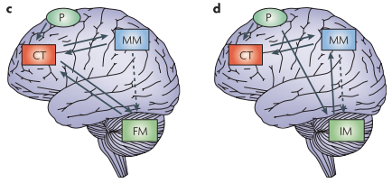

```{r}
setwd('~/Google_Drive/courses/Structural_Equation_Modeling/assignments/assignment_07/')
getwd()
```

# Introduction, research question, and hypotheses
When we read a novel or watch a movie, we use our database of social knowledge to understand characters and follow plot lines. For instance, knowledge about a character’s personality helps us understand how a character might act, while knowledge about their social relationships with other characters gives us the ability to predict how different characters will interact with one another. Regions of the “social brain”, which includes the ventral medial prefrontal cortex (vmPFC), precuneus (PCC), temporoparietal junction (TPJ), superior temporal sulcus (STS), and the anterior temporal lobes (ATL), have been shown to be important to representing social information (Binder & Desai, 2011; Pegado et al., 2018; Wasserman, Chakroff, Saxe, & Young, 2017), and for social processes, such as understanding other people’s mental states (Tamir, Thornton, Contreras, & Mitchell, 2016). Another region that has received less attention in its role in social cognition is the cerebellum (CB) (King, Hernandez-Castillo, Poldrack, Ivry, & Diedrichsen, 2019; Schmahmann & Sherman, 1998; Van Overwalle, D’aes, & Mariën, 2015). In my study, I hope to understand the influence of the cerebellum on regions of the social brain network. I will use structural equation modeling to understand the effective connectivity between regions of the social brain and the cerebellum. Effective connectivity refers to the correlation between the activity of brain regions during a task. This will be an exploratory analysis, as the current directional connectivity between regions of the social brain and the cerebellum are unknown. As there has been shown to be structural connectivity between regions of the cerebellum and the frontal and parietal cortices (Ito, 2008; Schmahmann, 2019), we hypothesize that there will be effective connectivity between the cerebellum and the vmPFC and TPJ.

There are two models that focus on the computational role of the cerebellum; the forward model and the inverse model. The forward model proposes that the cerebellum modifys the signals of other brain regions to result in an optimal output. The inverse model proposes that the cerebellum is able to create its own output for a task. In this study, we will test these two models using effective connectivity of brain regions during a task about social relationships. Specifically, we will see if the vmPFC acts a mediator between the PCC and the cerebellum. To test if the forward or inverse model is used in a task about social relationships, we will be testing if there is an indirect effect of PCC activations on cerebellum activations, or if the vmPFC acts as a mediator between the PCC and the cerebellum. If the vmPFC can account for part of the variation in the relationship between the PCC and the cerebellum, the forward model will be supported. If the vmPFC does not act as a medatior, and the PCC independently interacts with the vmPFC and the cerebellum, the the inverse model would be supported. Additionally, in a post-hoc analysis, we will test whether the forward or inverse model is supported by examining whether activations in the cerebellum are related to activations in the TPJ, where it is thought that mental models are represented. Again, we will test for an indirect effect to see if the cerebellum is related to the TPJ, while the vmPFC is independently related to the TPJ, thereby supporting the inverse model. Alternatively, if the vmPFC acts as a mediator between the cerebellum and the TPJ, the forward model will be supported.



Figure 1. Forward and inverse models of the cerebellum in relationship to social processing. Adapted from Ito (2008).
C) Forward model of the cerebellum in relation to social cognition. D) the inverse model of the cerebellum in relation to social cognition. For the current study, P refers to the precuneus, CT refers to the ventral medial prefrontal cortex, FM and IM refer to the cerebellum, and MM refers to the TPJ.

# Methods
We have scanned 28 participants while they completed a task about social relationships. In this task, participants were shown a relationship and two scenarios which are related to the relationship. Participants were instructed to choose the scenario which they thought was more likely to happen between the between in the presented relationship. Regions of interests (ROIs) will be identified using Neurosynth. The average time series for each of our ROIs will be extracted and correlated with each other to create a correlation matrix. This correlation matrix will be used to complete a path analysis to show the effectivity connectivity between regions of the social brain and the cerebellum.


## Model Syntax
### How does the cerebellum receive input?
```{r}
cerebellum_model <- '#direct effect 
           CB ~ c*PCC
           
           #DV ON Mediator
           CB ~ b*vmPFC
           
           #M ON IV
           PCC ~ a*vmPFC

           # indirect effect (a*b)
           ab := a*b
           
           # total effect
           total := c + (a*b)'
```
If C is not significant, but A and B are, then the forward model is supported. If C and A are significant, but B is not, the inverse model is supported.

### How does the cerebellum contribute input to the TPJ?
```{r}
mental_model <- '#direct effect 
           TPJ ~ c*CB
           
           #DV ON Mediator
           TPJ ~ b*vmPFC
           
           #M ON IV
           CB ~ a*vmPFC

           # indirect effect (a*b)
           ab := a*b
           
           # total effect
           total := c + (a*b)'
```
If C is not significant, but A and B are, then the forward model is supported. If C and B are significant, but A is not, the inverse model is supported.